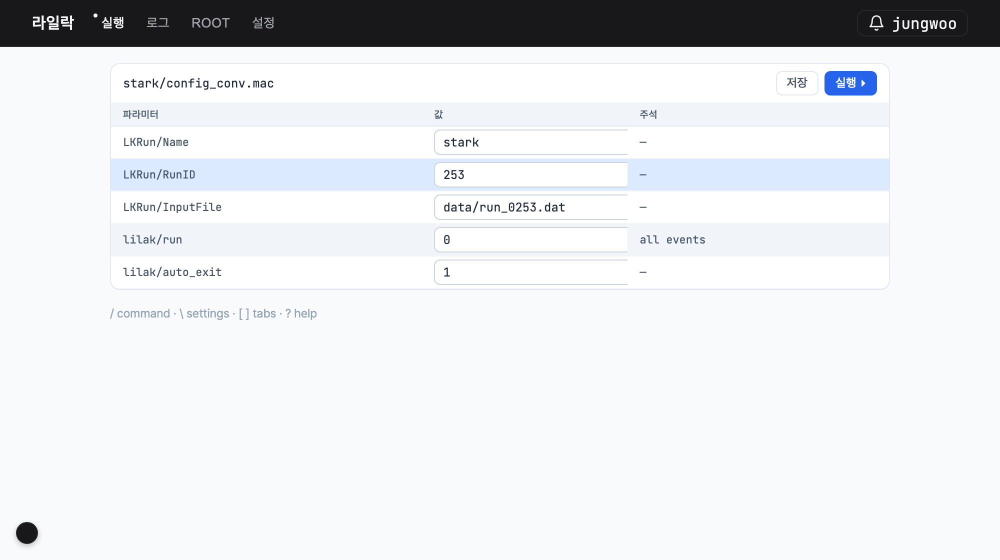
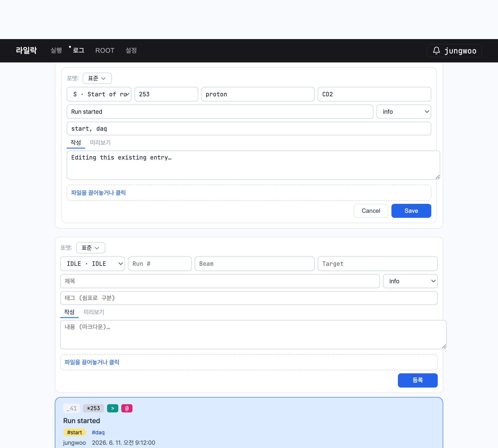
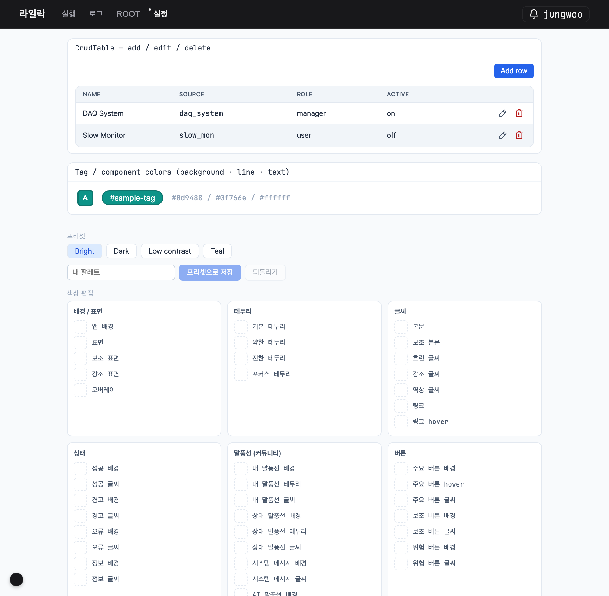

# lilak-ui

A compact, **theme-aware React UI kit** for LILAK projects — the electronic
logbook (`lilak_elog`), the LILAK control web, and future tools. One design
system, written once and shared, so every app starts from a finished shell
(theme, log views, command bar, admin tables) instead of rebuilding it.

Everything is one barrel import:

```js
import { TopBar, CommandBar, LogFeed, DataTable, applyTheme } from 'lilak-ui'
```

The whole kit lives under [`src/`](src/) as plain JSX + CSS variables — no build
step, no Tailwind. The host app's Vite transpiles the source directly.

---

## The demo gallery

`npm run demo` boots a single-file app ([`demo/main.jsx`](demo/main.jsx)) that
wires the kit into a realistic LILAK shell: a `TopBar` with tabs, a bottom
`CommandBar`, a drop-down system panel, full i18n (한국어 / English), and live
theme switching. Each tab exercises a different slice of the kit.

### Run tab — `DataTable` + `Card`

A parameter table (`LKRun/*`, `lilak/*`) rendered with `DataTable` (zebra rows,
mono columns, inline `Input` editors) inside a `Card` with header actions.



### Log tab — the elog domain (`LogComposer`, `LogFeed`)

The logbook model. `LogComposer` in **edit mode** (pre-filled from an existing
entry, Save / Cancel) on top, a fresh **create** composer with a format picker
and markdown write/preview below, then the `LogFeed` of entries with keyboard
navigation (`j`/`k`, space to expand).



### Settings tab — `CrudTable`, `ColorPicker`, `ColorSettings`

`CrudTable` (add / edit / delete over in-memory rows with a schema-driven
form), the component-mode `ColorPicker` (background · line · text for a tag),
and `ColorSettings` — the preset switcher (**Bright / Dark / Low contrast /
Teal**) plus the live per-token editor.



### Running it

```sh
npm install
npm run demo        # → http://localhost:5120
```

The port is read from `PORT` (see [`.env.example`](.env.example)), so
`PORT=5121 npm run demo` or a `.env.local` overrides it. The Vite config
([`vite.config.js`](vite.config.js)) roots Vite at `demo/` and serves the kit
from `src/` directly.

Keyboard shortcuts in the demo: `/` command bar · `\` system panel · `[` `]`
switch tabs · `g r/l/o/s` jump to a tab · `?` shortcuts modal.

---

## What's inside `src/`

### Theme — [`theme/`](src/theme/)

The single source of truth for every color and size.

- **`tokens.js`** — every color is a *semantic token* (`--app-bg`, `--surface`,
  `--text-primary`, `--btn-primary-bg`, …) enumerated in `TOKEN_GROUPS` with a
  value for each theme (**bright / dark / lowcontrast**). Grouped by category
  (surface / border / text / status / bubble / button / input / schedule) so
  the settings editor can render them.
- **`applyTheme.js`** — `applyTheme / setTheme / cycleTheme / buildThemeCSS`
  generate the CSS-variable blocks at runtime and drive `[data-theme]`. Font
  helpers `loadFonts / applyLangFont / FONT_DEFAULTS` swap the sans stack per
  language.
- **`presets.js`** — named palettes on top of a theme: `listPresets /
  applyPreset / saveCustomPreset / setTokenOverride / BUILTIN_PRESETS` (ships
  **Teal**).
- **`uiStyles.js`** — shared inline-style recipes + `hoverify`.

### Command + hotkey connector — [`command/`](src/command/) & [`commands.js`](src/commands.js)

- **`commands.js`** — the low-level matcher: `defineCommands / matchCommands /
  runCommand`.
- **`command/registry.js` + `CommandRegistry.jsx`** — a context store where
  components self-register commands and shortcuts (`useCommand / useCommands /
  useShortcut`). Registered entries auto-wire into the `CommandBar`, the global
  hotkey layer, and the `ShortcutsModal`. The CommandBar supports `/` commands,
  option pick-lists, Tab-autocomplete, a secure password mode, free-text and
  portal-`slot` modes, and lead-char **find modes**.

### Tag / search index — [`tags/`](src/tags/)

`TagIndexProvider` + `useTaggable / useTaggables / useTagIndex`. Any searchable
surface registers `{ id, label, tags, kind, number, run }`; `#tag` search
(AND-combined) queries the live index. The store is exposed via
`useSyncExternalStore`, so registration is cheap and render-safe.

### Data components — [`data/`](src/data/)

The unified collapsible data-entry abstraction: `DataCard` (collapsed = index
char + title + tags; open = image / text / node media), `DataGrid`
(roving-focus arrows + `hjkl`, space to toggle), and `makeDataFindModes /
DATA_INDEX / INDEX_CHARS` — the special-character index scheme (`% _ ^ & @ ~ >
!` per kind, `*` for bookmarks, backed by `bookmarks.js`).

### Log domain — [`log/`](src/log/)

The elog model, ported from `lilak_elog`: `LogEntryCard` (brief / normal /
rich), `LogList` (task-child nesting + configurable `groupBy` divider),
`LogToolbar`, `LogFeed`, `LogDetail`, `LogComposer` (create **and** edit),
`FormatPicker`, `NumberEntryField`, `Markdown`, plus `formatUtils` and
`tagColors`.

### CRUD scaffolding — [`crud/`](src/crud/)

`CrudForm` (schema-driven fields: text / number / email / password / textarea /
select / checkbox / color / custom, with `full`, `disabledOnEdit`,
`requiredOnCreate`) and `CrudTable` (a `DataTable` + auto edit/delete actions +
Add → inline form + delete-confirm).

### Primitives — [`components/`](src/components/)

`Button` (8 variants, sm/md, icon-only), `Input`, `Badge`, `Chip / ChipGroup`,
`Callout`, `Card`, `Tabs`, `SubTabs`, `Modal`, `DataTable`, `Avatar`
(seedable Phosphor-in-a-circle), `CopyField`, `Lightbox`, `DashboardGrid`,
`TimeRangePicker`, `SideNav`, `Pagination`, `ColorSettings`, `ColorPicker`,
plus the shell pieces `TopBar`, `CommandBar` (+ `barController.js`), `TopPanel`,
`Drawer`, `NotificationBell`, `ShortcutsModal`, `Menu`.

### Layout — [`layout/`](src/layout/)

`Box / Stack / Row / Grid / Container / Spacer`. Use these in glue code instead
of `className="flex …"`.

### App services & icons

- **[`i18n.jsx`](src/i18n.jsx)** — `LangProvider / useLang`; the consumer
  supplies the dictionaries.
- **[`identity.jsx`](src/identity.jsx)** — `IdentityProvider / useIdentity`
  (current author name).
- **[`auth/LoginForm.jsx`](src/auth/LoginForm.jsx)**, **[`hooks/useHotkeys.js`](src/hooks/useHotkeys.js)** (`useHotkeys / prettyKey`).
- **[`icons.jsx`](src/icons.jsx)** — `Icon` routed through one semantic `ICONS`
  map (a single swap changes an icon everywhere) + `customIcon / strokeIcon /
  fillIcon` factories for your own marks.

---

## Directory layout

```
src/
  index.js          # the public barrel (everything above)
  theme/            # tokens.js · applyTheme.js · presets.js · uiStyles.js
  commands.js       # low-level command match/run
  command/          # registry.js + CommandRegistry.jsx (the connector)
  tags/             # index.js + TagIndex.jsx (the search index)
  data/             # DataCard · DataGrid · dataFindModes · bookmarks
  log/              # LogEntryCard · LogFeed · LogList · LogDetail · LogComposer · …
  crud/             # CrudTable · CrudForm
  layout/           # Box · Stack · Row · Grid · Container · Spacer
  auth/             # LoginForm
  components/       # TopBar · CommandBar · Drawer · Modal · DataTable · …
  hooks/            # useHotkeys
  i18n.jsx · identity.jsx · icons.jsx
demo/               # the gallery app (npm run demo)
docs/images/        # the screenshots above
```

---

## Conventions

- **Tokens, not literals.** Colors come from `var(--…)`; font sizes from the
  `--fs-*` scale. A new color belongs in [`theme/tokens.js`](src/theme/tokens.js),
  a new icon in the `ICONS` map — never hardcoded inline.
- **No Tailwind in the kit.** Inline styles + CSS-vars only. Reach for the
  [`layout/`](src/layout/) primitives, never `className="flex …"`.
- **i18n at the edge.** Kit components never hardcode user-facing text; the
  consumer passes strings (or a dict-backed `t()`).
- **Add a component:** drop it in the right subfolder, export it from
  [`src/index.js`](src/index.js), and add a demo case so the gallery documents it.

## Gotchas

- **Provider stores.** The command-registry and tag-index context *value is the
  stable store* (not a per-render snapshot); read hooks subscribe via
  `useSyncExternalStore`. Putting a per-render value in a registration hook's
  deps causes an infinite "Maximum update depth" loop.
- **Border shorthand vs longhand.** Don't mix the `border` shorthand with
  longhand props across a rerender — React warns.

---

License: MIT.
</content>
